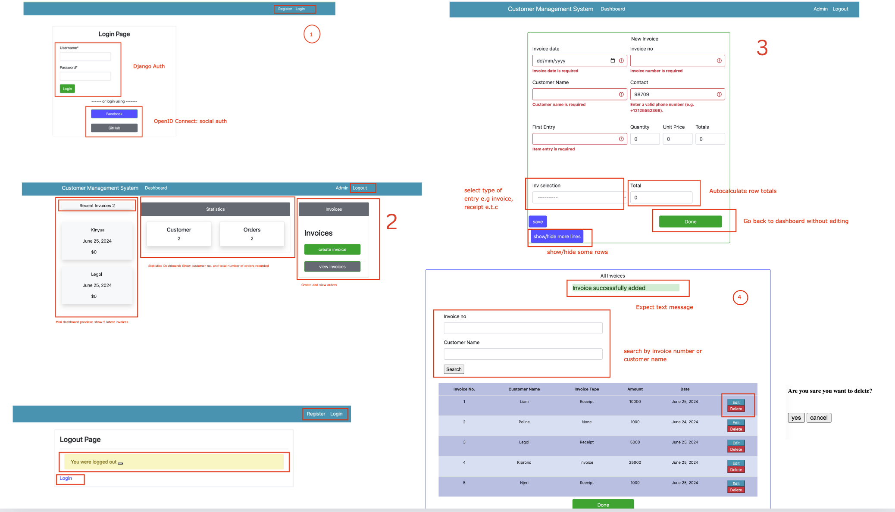

## Customer Management System with Django   :heart:

### Project Description
Welcome to my project where i build a django application with Docker.

The application works as follows:

> But first, imagine this: You own a shop selling different items for example phones, accessories e.t.c. You would like to have an in-house system that helps yomanage customer orders, right? perfect. I have the right solution for you.

#### An Overview of the workflow

#### Message Confirmation

Kindly refer to the above (attached) workflow

>    1. So, user (shop owner / staff) registers at the login page. They can do so in 2 ways:
>       - via django authentication,
>       - OpenID via Facebook and Github.
- Once logged in, they are met with a dashboard displaying different items:

>    2. The output of the program should be:
>       - `dashbaord preview`: Enables them to view the 5 latest invoices/receipts/notes provided or issued
>       - `statistics dashboard` : Displays a breakdown of different items (customers, orders and ino), and (i've saved the best for last..
>       - `Invoice creation page` : They will use this to create different entries especially invoices, receipts e.t.c. How does it work?

>    3. User clicks the create invoices button, and is transferred to an invoice creattion page

>    4. They enter the details of the entry (notice that you can add colums if more entries are required per customer)

>    5. The entry autocalculates all entries into one entry ( you dont want to have too many reciepts for just one order)

>    6. upon saving (hit save), the receipt is added to the database, the user is directed to a new page : the invoice view page.

>    7. In the invoice page they get to see what they have added. But before we proceed, see that when the record is saved a prompt is shown to confirm.

>    8. Then, a message is sent to the customer that their order has been placed (how awesome!)

>    9. On this page, the user can edit a receipt (if wrongfully entered or even delete it entirely)

>    10. If they are satisfied, they can hit done and are redirected to the dashboard.

Vuala! 

## Setup
### Prerequisites
- You can spin up a postgres container instance with the following process
>    1. Install docker, start the daemon and pull Postres image
>       - `docker pull postgres`

>    2. Create an instance: 
>       - `docker run -d -e POSTGRES_USER=<user> -e POSTGRES_PASSWORD=<preferred-password> --name postgres-container -p 5432:5432 postgres`: 

>    3. Access the created instance: 
>       - `docker exec -it postgres-container bash`

>    4. login: 
>       - `psql -h localhost -U user`

>    5. You can create a database or use the default `postgres` database 
>       - `CREATE DATABASE <database-name>`
>       - 

>    6.  Grant all privileges to the created user 
>        - `GRANT ALL PRIVILEGES ON DATABASE <database-name> to <preferred-user`    

>    7. Remember to update your `.env` file with the details created

### Bulding the Project 

 - You can build the project with the following command
 - Activate the python environment
  `source my-env/bin/activate `
- Then build:
 `docker-compose up --build`
>    Expect the project to be running at `localhost:8000`

>    Check out my hosted application on Render: `https://customer-management-system-n6c7.onrender.com` 

- Then have a look at the system design and CI-CD designs below

### System Design

## CI/CD Pipeline

### Future Improvements
- UI Design
- Internal feature improvement

Happy coding :nerd_face: . bye :wave:

